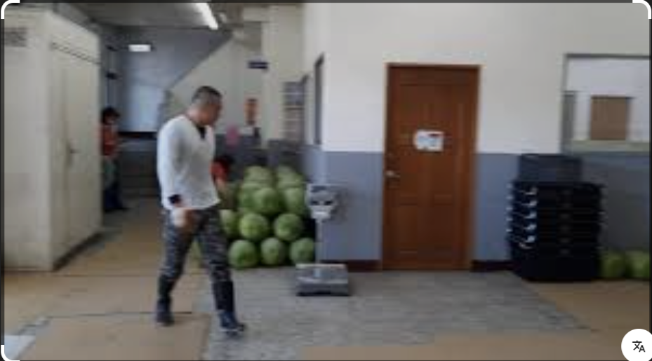
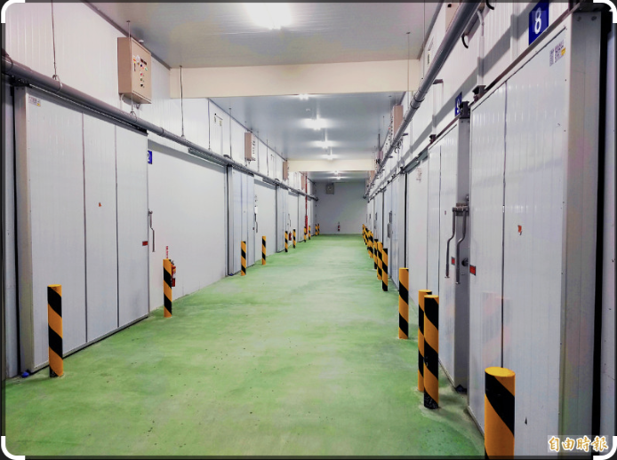
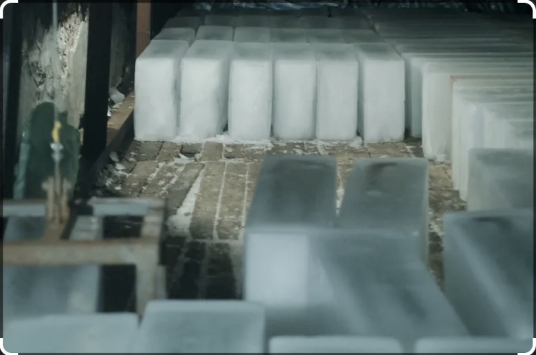
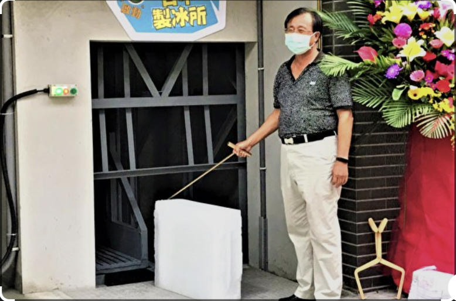
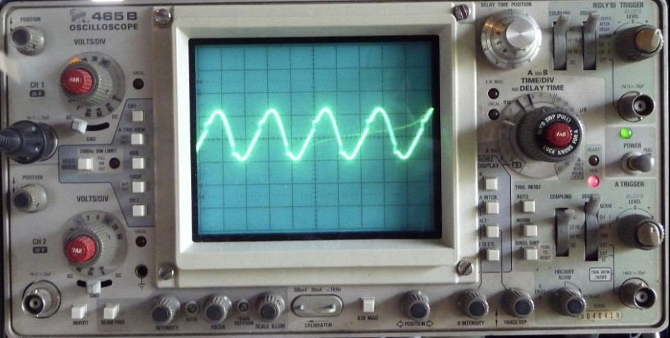
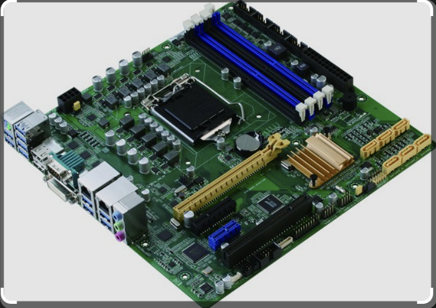
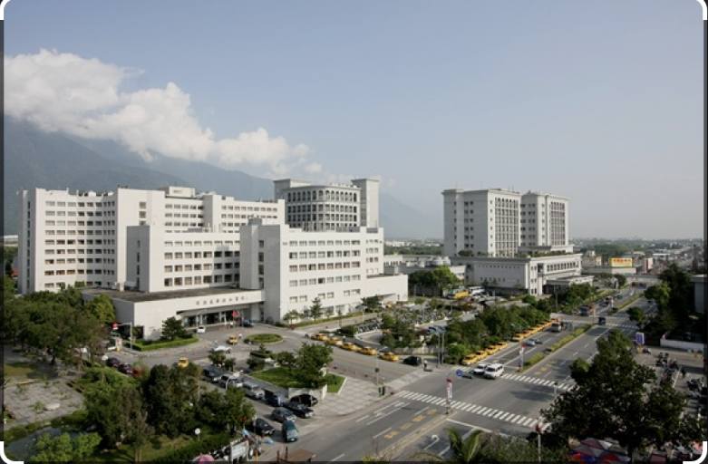
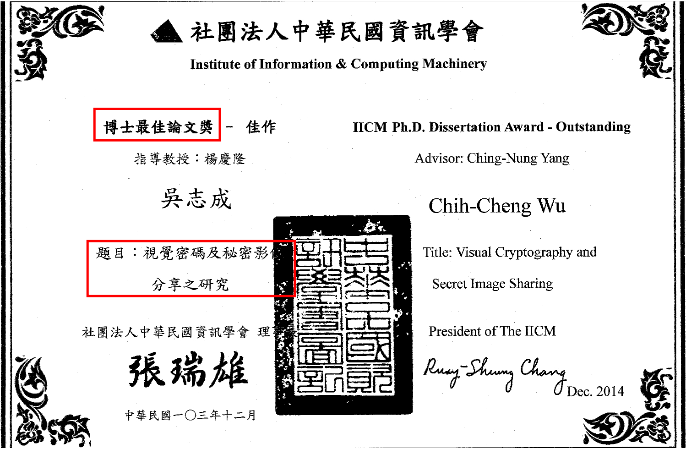
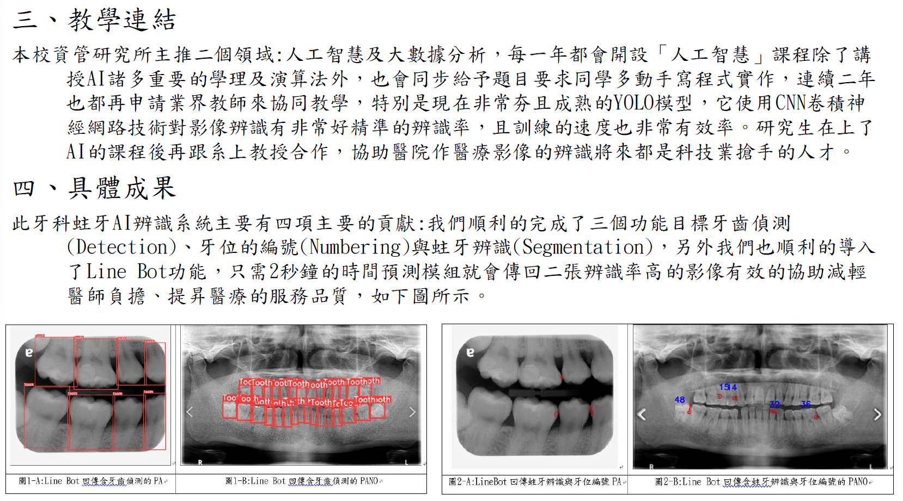
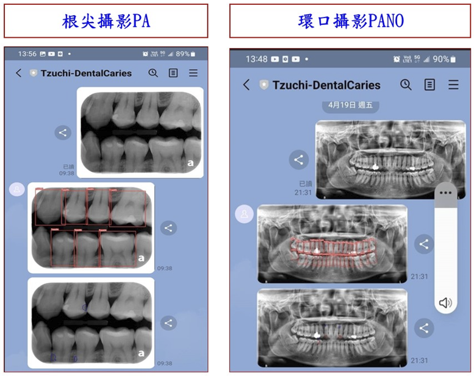

# 主題：技專 × 產業連結 - 分享

## 一位技職生的產業之路

講者：
慈濟大學資訊管理學系 專任助理教授

---

# 目錄

- 一、我的簡歷
- 二、我的生涯故事
- 三、電子科學生未來的方向
- 四、感想 - 結語
- 五、Q&A 互動

---

# 一、我的簡歷：其實我也是花工畢業的

- 我是花蓮高工電工科畢業
- 我以前也不知道自己未來要做什麼,資訊取得不易 (資訊=機會)
- 當年沒有 AI、沒有 ChatGPT、沒有智慧型手機, Internet不流行 (就業只有更生日報,聯合報,...就業服務站, 學校川堂公告欄, ...)
- 但人生一路從：
  - 1.冷凍空調 (1年)
    - 青輔會微電腦訓練班 (8個月)
  - 2.電腦維修: (3年)
  - 3.醫院資訊室: (31年)
    - 東華資工系進修 (3+6年)
      - 密碼學, 視覺密碼, 資訊安全
  - 4.慈濟大學資管系任教
    - 程式設計, 醫療資訊, 人工智慧, 大數據分析, AI 醫療影像辨識
    - 證照考試, 程式設計研習營
- 感想:
  - 「人生不是一次決定就固定了」是不斷的找機會/培養能力/選擇/蛻變
  - 動力/資訊/改變 (不斷精進)
  - 老師也有Miss　（人生沒有後悔藥)

---

# 二、我的生涯故事

---

## 1.花蓮高工 → 勤益工專冷凍科

### 技職教育的特色：

- 重視實作, 動手能力
- 比較早接觸現場技術 (實習, 職場)
- 可以直接與產業接軌 (高二暑假水電行實習, 當兵前冷凍空調工作)
- **如何製冷, 仔細看了十頁的原文書**
- **最大感想: 堅持自己的興趣**

---

## 2. 第一份工作：冷凍空調維修

## 花蓮果菜市場冷凍空調維修（一年）

### 工作內容：

- 冷凍設備維修
- 空調維修
- 現場故障排除
- 製冰
- 需輪三班
- 圖示
  
  
  
  
  

### 當時的想法：

- 冷凍設備故障: 維修現場壓力較大
- 工作無趣,行禮如儀, 不覺辛苦:不知道未來發展
- 時間,勞力換取薪資
- 需要一些冷凍技術
- 會想報考: 鐵路局, 或其他國營事業

### 但也學到：

- 責任感
- 解決問題能力
- 現場應變能力
- 與人相處的能力 (摸索/練習)

---

## 3. 人生第一次轉折

## 到青輔會學習微電腦

### 受訓 8 個月

當時開始接觸：

- 電腦 (計算機架構)
- Basic 程式設計
- 資訊系統概念
- **唸了很多 (電腦) 書籍**

### 我開始發現：

> 「原來自己對資訊產業很有興趣, 包含: 軟體, 硬體, 韌體」
>
> **韌體 :**
>
> **電腦**開機時，CPU 會先被硬體重設（reset），其 Program Counter（PC）會指向一個固定的啟動位址（Reset Vector），該位址通常對應到 ROM 或 Flash Memory 中所儲存的韌體（Firmware，如 BIOS 或 UEFI）。
>
> 接著 CPU 便開始執行韌體中的機器指令，進行記憶體與周邊設備檢查、硬體初始化與系統設定等工作。初始化完成後，韌體會尋找開機裝置並載入作業系統，最後由作業系統接管整個電腦系統。
>
> 註1: 家電、手機, 汽車、洗衣機、微波爐、冷氣機, 印表機, 智慧手錶 / 穿戴裝置, 無人機, 電梯, 無線耳機, 嵌入式設備
>
> 註2: **當電子設備啟動時**，處理器 CPU 或 MCU (Microcontroller）會先被硬體重設（reset），其 Program Counter（PC）, ........

---

## 4. 王安電腦硬體工程師（三年）

### 工作內容：

- PC 維修
- Mini Computer 維修
- 故障排除
- 硬體檢修
  - 示波器: 主要用於**觀察和量測**隨時間變化的電壓訊號（時域分析）。它可以顯示波形的形狀、幅度、頻率、週期等
    - 圖示
      
      
  - MICE:  (MICE = Micro Instruction Control Equipment)
    - 可以送「單一步 microinstruction」
      強迫 CPU 執行特定控制訊號
      配合示波器量測 TTL IC 腳位
      找故障 IC
      用於 mini computer 維修

### 當時學到：

- 邏輯分析能力
- Troubleshooting 能力
- 工程師思維
  - 問題導向 (Problem Solving) - 解決問題的能力
  - 行勝於言 (Action-oriented) - 傾向先動手實作驗證, 再持續優化
  - 結構化與拆解 (Decomposition) - Divide and Conque
  - 在限制條件下（資源、時間）尋求最佳解
  - 最難搞的 Intermittent (間歇的; 斷斷續續的)
- 收獲滿滿: 讀了很多英文技術文件
- 感觸: 對電子電路中最基礎、最常見的元件不親, 沒繼續走下去
  - 電晶體 (Transistor), 二極體 (Diode), 電容 (Capacitor)

---

# 5. 慈濟醫學中心資訊室（31年）

## 歷任：

- 硬體工程師
- 程式設計師
- 醫療資訊組組長
- 資訊室專員兼資料庫管理員(DBA, Database Administrator)
- 圖示
  
- 資訊室業務

  - 醫療資訊系統: 醫師,護理師, 藥師, 檢驗師, ...所有醫技人員
  - 病人掛號, 病人繳費, 診間報到, 各式線上服務 (網頁/APP)
  - (電子)病歷系統, 各類檢查系統, 各類影像系統PACS
  - 庫存, 採購, 護理站撥補系統, 護理站看板, 智慧病房, 智慧醫院
  - 人事, 會計, 公文簽呈系統(辦公室自動化)

---

### 醫院資訊不是只有寫程式

還包括：

- 醫療流程
- 系統整合
- 網路管理
- 資訊安全
- 資料庫
- 伺服器
- 使用者需求
- 專案管理

---

## 6. 持續進修

## 一邊工作、一邊念書

完成：

- 東華大學
- 資工所碩士班
- 資工所博士班
- 圖示
- 

---

## 研究領域：

- 資訊安全
- 密碼學
- 視覺密碼
- AI 醫療影像辨識

---

## 7. 現在的工作

## 慈濟大學資管系專任助理教授

教授：

- 資訊安全 ( kernel 密碼學)
- 程式設計, 醫療資訊
- 人工智慧 (研究所)
- 大數據分析 (研究所)

---

# AI 醫療影像辨識 - 牙齒蛀牙 AI 辨識

帶領研究生, 透過 AI, 深度學習：

- 分析 X 光影像
- 偵測蛀牙區域
- 協助醫師判讀 (避免漏診)
- 圖示
  
  

---

# 三、電子科學生未來的方向

---

# 1. 半導體產業

台灣的重要產業：

- 設備工程師
- 測試工程師
- 自動化工程師
- 機台維修工程師

---

# 2. 自動控制與智慧製造

未來工廠越來越智慧化：

- PLC
- 感測器
- IoT
- 自動控制
- 工業4.0

---

# 3. 資訊與網路產業

電子科也很適合：

- 網路管理
- 資訊安全
- AI
- 雲端技術
- 系統整合 (有電子科同學在DELL)
- 也非常適合寫驅動程式及韌體

---

# 4. AI + 電子

未來非常重要：

- AI 機器人
- AI 監控
- 智慧家居
- 無人機
- 邊緣運算

---

# 未來趨勢

# 「電子與資訊將越來越整合」

---

# 四、感想 - 結語

---

# 1.不一定一次找到人生方向

很多人都是：

- 工作後
- 接觸產業後
- 才慢慢找到方向

---

# 2. 業界最需要的人才「能跨領域的人」

未來很少只有單一專業。

例如：

- 電子 + 資訊
- 電子 + AI
- AI + 醫療
- 醫療 + 資訊
- 資安 + 網路
- 系統 + 管理

# 3. 持續學習

科技變化非常快：

- AI
- 半導體
- 網路
- 資安
- 英文

都在快速改變。

---

# 4. 溝通能力+人緣+上台報告能力

很多工程師升不上去，
不是技術不好，
而是無法與人溝通合作
主管常需上台說明報告/爭取資源支持 (不會說話就很吃虧,需要多練習)

---

感想/心得:

- 「人生不是一次決定就固定了」是不斷的找機會/培養能力/選擇/蛻變
- 動力/資訊/改變 (不斷精進)
- 老師也有Miss　（人生沒有後悔藥)

# 未來的你，可能比現在想像得更厲害

# 人有無限的可能

# 技職其實很有優勢

因為：

- 有實作能力
- 了解現場
- 動手能力強
- 比較貼近產業

---

# Q & A

謝謝大家
